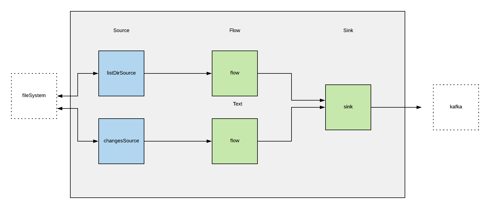

# Task at work
Features: 
1)  List all files in directory and send their names to kafka
2)  Track each new created file in directory and send to kafka

Specific: 
Handle application restart, save state of processed files on local node (decoupled from kafka)

## Solution
For listing all files and tracking events in directory I used [alpakka file connector](https://developer.lightbend.com/docs/alpakka/current/file.html)  

1) Listing  
```
final Source<PathAndProcessed, NotUsed> listDirSource = Directory.ls(fs.getPath(imgDir))
  .mapAsync(1, (Path e) -> {
    return
      PatternsCS.ask(
        persistentActor,
        new IsFileProcessed(e.toString()),
        Duration.ofSeconds(4).toMillis())
          .thenApply(a -> (IsFileProcessedAnswer) a)
          .thenApply(isFileProcessedAnswer -> new PathAndProcessed(e.toString(), isFileProcessedAnswer.isAnswer()));
  });
```


2) Tracking
``` 
final Source<PathAndProcessed, NotUsed> changesSource =
  DirectoryChangesSource
    .create(fs.getPath(imgDir), pollingInterval, maxBufferSize)
    .filter(pair -> pair.second().equals(DirectoryChange.Creation))
    .map(Pair::first)
    .map(e -> {
      out.println("New file: " + e.toString());
      return new PathAndProcessed(e.toString(), false);
  });
```

Specific:
For handling state was create `DirListingStatePersistentActor`, which use levelDB.  
``` 
<dependency>
  <groupId>org.iq80.leveldb</groupId>
  <artifactId>leveldb</artifactId>
  <version>0.7</version>
</dependency>
```
While `listing` -> ask persistent actor is file processed
``` 
...
PatternsCS.ask(
  persistentActor,
  new IsFileProcessed(e.toString())
...
``` 
While sink record to kafka, tell to persistent actor that file processed. 

``` 
persistentActor.tell(new Cmd(e.key()), null);
```
e.key() is filename from ProducerRecord.

When application restarts, persistent actor recover state from levelDB.  

## Akka-streams topology 



